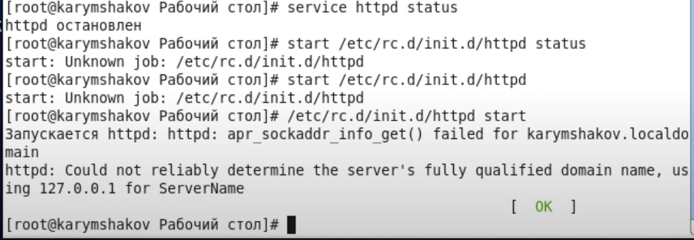
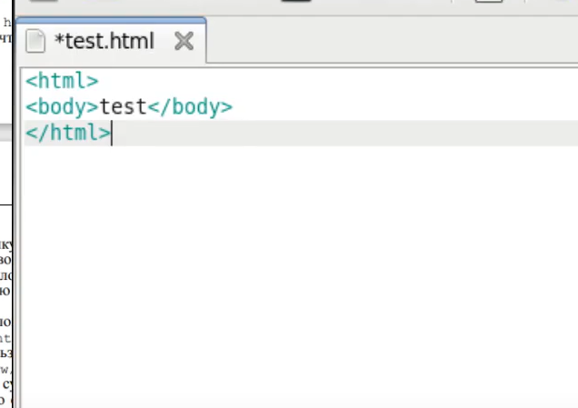
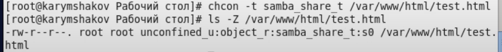
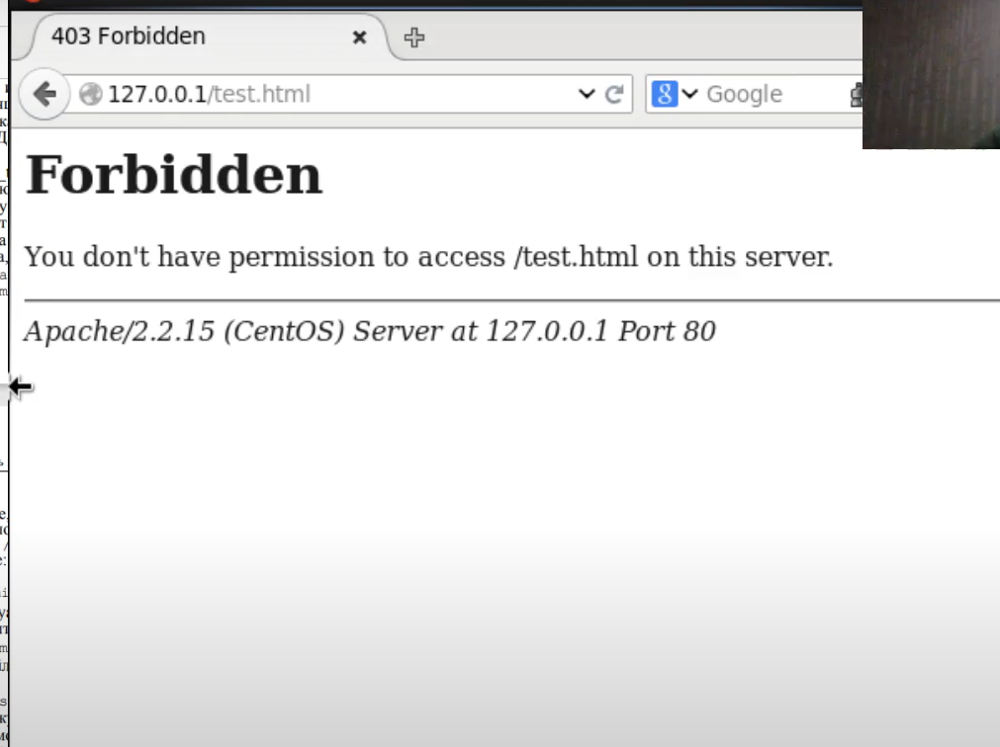
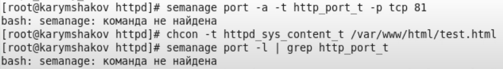

---
## Front matter
lang: ru-RU
title: Лабораторная работа №6
author: |
	Карымшаков А.А. - студент группы НФИбд-03-18
date: 15.02.2022

## Formatting
toc: false
slide_level: 2
theme: metropolis
header-includes: 
 - \metroset{progressbar=frametitle,sectionpage=progressbar,numbering=fraction}
 - '\makeatletter'
 - '\beamer@ignorenonframefalse'
 - '\makeatother'
aspectratio: 43
section-titles: true
---

# Мандатное разграничение прав в Linux

## Прагматика выполнения

- Для приобритения навыков администрирования ОС Linux знание SELinux является необходимым.

## Цель выполнения лабораторной работы

- Развить навыки администрирования ОС Linux. Получить первое практическое знакомство с технологией SELinux.    
- Проверить работу SELinx на практике совместно с веб-сервером Apache.

## Задачи выполнения работы

- Подготовить лабораторный стенд и ознакомиться с методическими рекомендациями;
- С помощью различных примеров ознакомиться с работой SELinux и веб-сервисом Apache.

## Результаты выполнения лабораторной работы

- С помощью различных примеров ознакомился с работой SELinux и веб-сервисом Apache (рис - @fig:005, рис - @fig:006, рис - @fig:007, рис - @fig:008, рис - @fig:09).

{ #fig:005 width=70% }

##

{ #fig:006 width=70% }

##

{ #fig:007 width=70% }

{ #fig:008 width=70% }

##

{ #fig:009 width=70% }

##

Таким образом, я развил навыки администрирования ОС Linux, получил первое практическое знакомство с технологией SELinux, проверил работу SELinx на практике совместно с веб-сервером Apache.