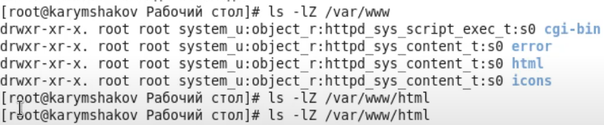

---
# Front matter
lang: ru-RU
title: "Лабораторная работа №6"
subtitle: "Мандатное разграничение прав в Linux"
author: "Карымшаков Артур Алишерович"

# Formatting
toc-title: "Содержание"
toc: true # Table of contents
toc_depth: 2
lof: true # List of figures
lot: true # List of tables
fontsize: 12pt
linestretch: 1.5
papersize: a4paper
documentclass: scrreprt
polyglossia-lang: russian
polyglossia-otherlangs: english
mainfont: PT Serif
romanfont: PT Serif
sansfont: PT Sans
monofont: PT Mono
mainfontoptions: Ligatures=TeX
romanfontoptions: Ligatures=TeX
sansfontoptions: Ligatures=TeX,Scale=MatchLowercase
monofontoptions: Scale=MatchLowercase
indent: true
pdf-engine: lualatex
header-includes:
  - \linepenalty=10 # the penalty added to the badness of each line within a paragraph (no associated penalty node) Increasing the value makes tex try to have fewer lines in the paragraph.
  - \interlinepenalty=0 # value of the penalty (node) added after each line of a paragraph.
  - \hyphenpenalty=50 # the penalty for line breaking at an automatically inserted hyphen
  - \exhyphenpenalty=50 # the penalty for line breaking at an explicit hyphen
  - \binoppenalty=700 # the penalty for breaking a line at a binary operator
  - \relpenalty=500 # the penalty for breaking a line at a relation
  - \clubpenalty=150 # extra penalty for breaking after first line of a paragraph
  - \widowpenalty=150 # extra penalty for breaking before last line of a paragraph
  - \displaywidowpenalty=50 # extra penalty for breaking before last line before a display math
  - \brokenpenalty=100 # extra penalty for page breaking after a hyphenated line
  - \predisplaypenalty=10000 # penalty for breaking before a display
  - \postdisplaypenalty=0 # penalty for breaking after a display
  - \floatingpenalty = 20000 # penalty for splitting an insertion (can only be split footnote in standard LaTeX)
  - \raggedbottom # or \flushbottom
  - \usepackage{float} # keep figures where there are in the text
  - \floatplacement{figure}{H} # keep figures where there are in the text
---

# Цель работы

Развить навыки администрирования ОС Linux. Получить первое практическое знакомство с технологией SELinux. [1]    
Проверить работу SELinx на практике совместно с веб-сервером Apache.

# Задание

1. С помощью различных примеров ознакомиться с работой SELinux и веб-сервисом Apache.

# Выполнение лабораторной работы

1. С помощью различных примеров ознакомился с работой SELinux и веб-сервисом Apache.  

Вошел в систему с полученными учетными данными и убедился, что SELinux работает в режиме enforcing политики targeted с помощью команд \texttt{getenforce} и \texttt{sestatus} (рис - @fig:005).

{ #fig:005 width=70% }

Обралится с помощью браузера к веб-серверу, запущенному на моем компьютере, и убедился, что последний работает с помощью команды \texttt{/etc/rc.d/init.d/httpd status}, предварительно запустив его с помощью команды \texttt{/etc/rc.d/init.d/httpd start} (рис - @fig:006).

{ #fig:006 width=70% }

Нашел веб-сервер Apache в списке процессов и определил его контекст безопасности с помощью команды \texttt{ps auxZ | grep httpd} (рис - @fig:007).

{ #fig:007 width=70% }

Посмотрел текущее состояние переключателей SELinux для Apache с помощью команды \texttt{sestatus -b} (рис - @fig:008). Многие из низ находятся в положении "off".

{ #fig:008 width=70% }

Определил тип файлов и поддиректорий, находящихся в директории \texttt{/var/www}, с помощью команды \texttt{ls -lZ /var/www} (рис - @fig:010).

{ #fig:010 width=70% }

Определил тип файлов, находящихся в директории \texttt{/var/www/html} с помощью команды \texttt{ls -lZ /var/www/html} (рис - @fig:011).

{ #fig:011 width=70% }

Консоль ничего не выводит, поскольку дирректория пуста.

Создал от имени суперпользователя html-файл \texttt{/var/www/html/test.html} следующего содержания (рис - @fig:013):

{ #fig:013 width=70% }

Проверил контекст созданного мною файла (рис - @fig:014):

{ #fig:014 width=70% }

Проверил контекст файла с помощью команды \texttt{ls -Z /var/www/html/test.html} (рис - @fig:016).

{ #fig:016 width=70% }

Изменил контекст файла \texttt{/var/www/html/test.html} с httpd_sys_content_t на samba_share_t (рис - @fig:017).

{ #fig:017 width=70% }

Попробовал еще раз получить доступ к файлу через веб-сервер, введя в браузере адрес \texttt{http://127.0.0.1/test.html}. Получил ошибку (рис - @fig:018).

{ #fig:018 width=70% }

Проанализировал ситуацию. Просмотрел log-файлы веб-сервера Apache, а также посмотрел системный лог-файл с помощью команды \texttt{tail /var/log/messages} (рис - @fig:019).

{ #fig:019 width=70% }

Просмотрел файл /var/log/http/access_log (рис - @fig:022).

Выполнил команду semanage port -a -t http_port_t -p tcp 81. После этого проверил список портов командой semanage port -l | grep http_port_t (рис - @fig:024). Убедился, что порт 81 появился в списке.

{ #fig:024 width=70% }

Вернул контекст httpd_sys_content_t к файлу \texttt{/var/www/html/test.html} с помощью команды chcon -t httpd_sys_content_t /var/www/html/test.html (рис - @fig:025). После этого попробовал получить доступ к файлу через веб-сервер, введя в браузере адрес \texttt{http://127.0.0.1:81/test.html} (рис - @fig:026).

{ #fig:025 width=70% }

{ #fig:026 width=70% }

Исправил обратно конфигурационный файл apache, вернув \texttt{Listen 80} (рис - @fig:027).

{ #fig:027 width=70% }

Удалил файл \texttt{/var/www/html/test.html} (рис - @fig:029).

{ #fig:029 width=70% }

# Выводы

Развил навыки администрирования ОС Linux. Получил первое практическое знакомство с технологией SELinux.

Проверил работу SELinx на практике совместно с веб-сервером Apache.

# Список литературы

1. Кулябов Д. С., Королькова А. В., Геворкян М. Н. Информационная безопасность компьютерных сетей. Лабораторная работа № 6. Мандатное разграничение прав в Linux.
